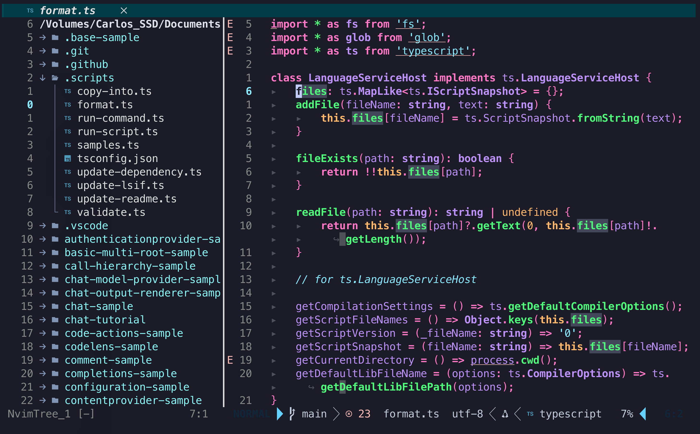
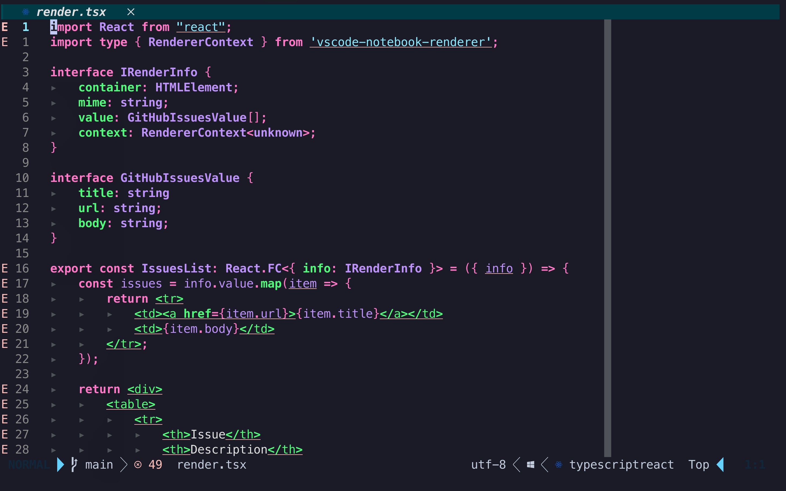
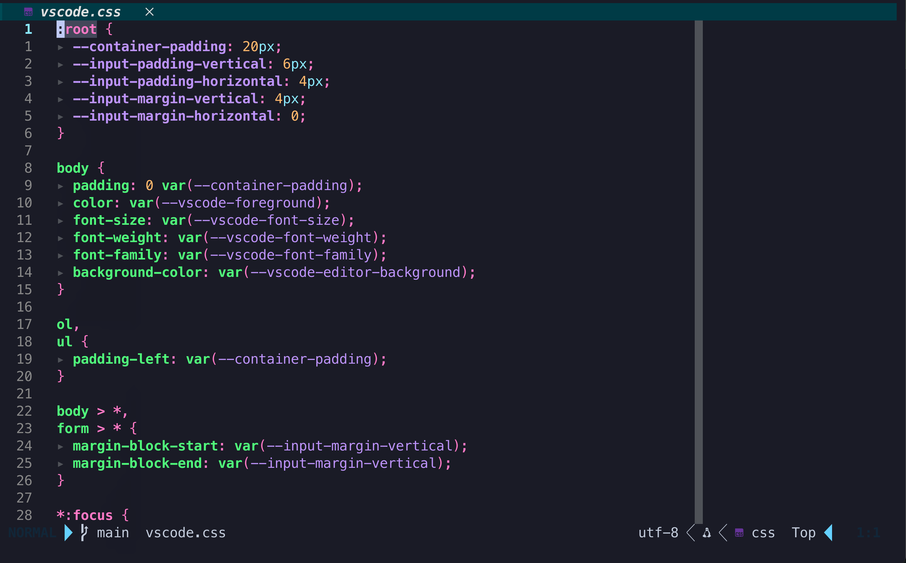
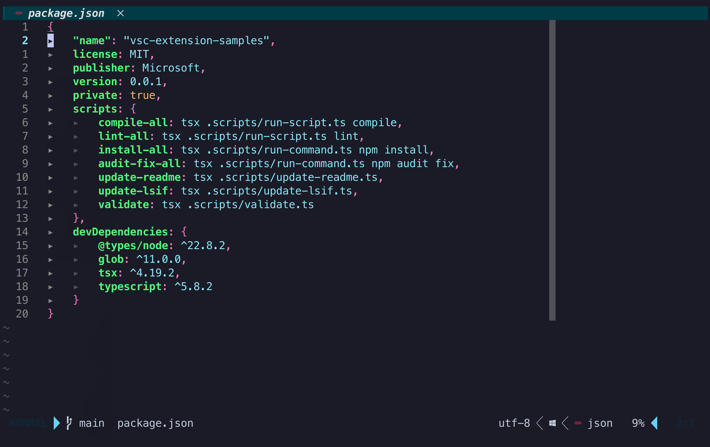

# CargDev-Cyberpunk.nvim

A vibrant, high-contrast Neovim color scheme crafted for developers who thrive in bold, electrifying visuals. Built with TypeScript support and atomic design principles in mind, this theme delivers blazing neon tones and a cyberpunk aesthetic that maximizes focus and visual impact.

## Features

- **High-Contrast Neon Colors**: Hot pink keywords, electric purple types, vibrant cyan strings, and lush green functions
- **Cyberpunk Aesthetic**: Deep blue backgrounds with neon accents for maximum visual impact
- **TypeScript Support**: Comprehensive LSP and Treesitter highlighting for TypeScript/JavaScript
- **Atomic Design**: Modular structure following atomic design principles
- **Bold Styling**: High-saturation colors with bold styling for maximum readability
- **LSP Integration**: Full support for Language Server Protocol highlighting
- **Treesitter Support**: Advanced syntax highlighting with Treesitter

## Screenshots

### TypeScript


### TypeScript React (TSX)


### CSS


### JSON


## Color Palette

### Syntax Colors
- **Keywords**: `#FF79C6` - Control flow and declarations (bold)
- **Functions**: `#50FA7B` - Function calls and definitions (bold)
- **Strings**: `#8BE9FD` - String literals and comments
- **Numbers**: `#FFB86C` - Numeric literals and constants
- **Types**: `#BD93F9` - Type annotations and interfaces (bold)
- **Variables**: `#BD93F9` - Variable names
- **Properties**: `#50FA7B` - Object properties (bold)

### Background Colors
- **Primary**: `#002B36` - Deep blue background
- **Secondary**: `#003B46` - Secondary background
- **Tertiary**: `#004B56` - Tertiary background
- **Cursor Line**: `#112233` - Slightly lighter than background
- **Selection**: `#44475A` - Selection highlight

### Special Colors
- **Error**: `#FF5555` - Error messages (bold)
- **Warning**: `#FFB86C` - Warning messages
- **Info**: `#8BE9FD` - Information messages
- **Success**: `#50FA7B` - Success indicators

## Installation

### Using Packer
```lua
use {
  'cargdev-cyberpunk.nvim',
  config = function()
    require('cargdev-cyberpunk').setup()
  end
}
```

### Using Lazy.nvim
```lua
{
  'cargdev-cyberpunk.nvim',
  config = true,
}
```

### Manual Installation
1. Clone this repository to your Neovim plugins directory:
```bash
git clone https://github.com/yourusername/cargdev-cyberpunk.nvim ~/.local/share/nvim/site/pack/plugins/start/cargdev-cyberpunk.nvim
```

2. Add to your `init.lua`:
```lua
require('cargdev-cyberpunk').setup()
```

## Configuration

### Basic Setup
```lua
require('cargdev-cyberpunk').setup()
```

### Advanced Configuration
```lua
require('cargdev-cyberpunk').setup({
  -- Future configuration options will be added here
})
```

### Customizing Colors
You can easily override colors by requiring the colors module:

```lua
local colors = require('cargdev-cyberpunk.colors')

-- Override specific colors
colors.override({
  syntax = {
    keyword = "#FF0000",  -- Make keywords red
    function = "#00FF00", -- Make functions green
  },
  bg = {
    primary = "#000000",  -- Make background pure black
  }
})
```

## Usage

After installation, the color scheme will be automatically applied. You can also manually apply it:

```lua
-- Apply the color scheme
require('cargdev-cyberpunk').apply_highlights()
```

## Architecture

The plugin follows atomic design principles with a modular structure:

```
lua/cargdev-cyberpunk/
├── init.lua          # Main plugin entry point
├── colors.lua        # Color palette definitions
└── plugin.lua        # Plugin configuration
```

### Modules

- **`init.lua`**: Main setup and configuration functions
- **`colors.lua`**: Centralized color palette with vibrant cyberpunk colors
- **`highlights.lua`**: Comprehensive highlight group definitions for all syntax elements

## TypeScript Support

This color scheme includes extensive TypeScript support:

- **LSP Integration**: Full support for TypeScript Language Server highlighting
- **Treesitter**: Advanced syntax highlighting with Treesitter
- **Type Annotations**: Special highlighting for type annotations and interfaces
- **Import/Export**: Distinct colors for import and export statements
- **Decorators**: Support for TypeScript decorators
- **Generics**: Proper highlighting for generic types

## Requirements

- Neovim 0.8.0 or higher
- Treesitter (recommended for best experience)
- LSP support (recommended for TypeScript features)

## Contributing

Contributions are welcome! Please feel free to submit a Pull Request.

### Development Setup
1. Fork the repository
2. Create a feature branch
3. Make your changes
4. Test thoroughly
5. Submit a pull request

## License

This project is licensed under the MIT License - see the [LICENSE](LICENSE) file for details.

## Acknowledgments

- **Neovim Community**: For the excellent plugin ecosystem
- **Cyberpunk Aesthetic**: Inspired by the vibrant neon colors of cyberpunk culture

## Support

If you encounter any issues or have questions:

1. Check the [Issues](https://github.com/yourusername/cargdev-cyberpunk.nvim/issues) page
2. Create a new issue with detailed information
3. Include your Neovim version and configuration

---

**Enjoy coding with vibrant colors!**

*"If I squint at this theme, I should feel like Tron is about to compile!"* 
